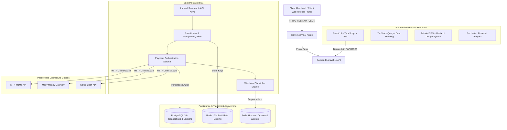

# 💳 KPay / PayHub Africa — FinTech Payment Gateway & Orchestrator

[](https://www.php.net/)
[](https://laravel.com/)
[](https://react.dev/)
[](https://www.typescriptlang.org/)
[](https://www.postgresql.org/)
[](https://redis.io/)
[](https://tailwindcss.com/)

Plateforme SaaS B2B d'orchestration et de passerelle de paiements mobiles et bancaires pour l'Afrique de l'Ouest (MTN MoMo, Moov Money, Celtiis Cash, Cartes Visa/Mastercard). Conçue selon une architecture modulaire, résiliente aux pannes, idempotente et orientée événements.

---

## 🏛️ Architecture Globale du Projet



---

## 📂 Structure du Répertoire

```text
projet-1-kpay-fintech-orchestrator/
├── docker-compose.yml          # Orchestration complète conteneurisée
├── README.md                   # Documentation technique générale
├── backend/                    # API Laravel 11
│   ├── app/
│   │   ├── Http/Controllers/   # Transactions, Webhooks, Wallets, ApiKeys
│   │   ├── Http/Requests/      # Validation FormRequest
│   │   ├── Http/Resources/     # API Transformers
│   │   ├── Models/             # Transaction, Merchant, WebhookLog, Wallet
│   │   ├── Services/           # PaymentOrchestrationService, MoMoProvider
│   │   └── Jobs/               # DispatchWebhookJob (Exponential Backoff)
│   ├── config/
│   ├── database/migrations/    # Schéma des tables financières
│   ├── routes/api.php          # Endpoints v1
│   ├── composer.json
│   └── .env.example
└── frontend/                   # Dashboard Marchand React (TypeScript)
    ├── src/
    │   ├── api/                # Client Axios & endpoints
    │   ├── components/         # Cartes KPI, Tableau de transactions, Modales
    │   ├── pages/              # Dashboard, Transactions, Webhooks, Clés API
    │   ├── types/              # Définitions TypeScript complètes
    │   ├── App.tsx
    │   └── main.tsx
    ├── package.json
    ├── tailwind.config.js
    └── vite.config.ts
```

---

## 🚀 Démarrage Rapide avec Docker

```bash
# 1. Cloner le repository
cd projet-1-kpay-fintech-orchestrator

# 2. Lancer les services (PostgreSQL, Redis, Laravel API, React Dashboard)
docker-compose up -d --build

# 3. Initialiser le backend
docker-compose exec backend php artisan migrate --seed
docker-compose exec backend php artisan key:generate

# 4. Accès aux applications
# Backend API: http://localhost:8000/api/v1
# Frontend Dashboard: http://localhost:3000
```
